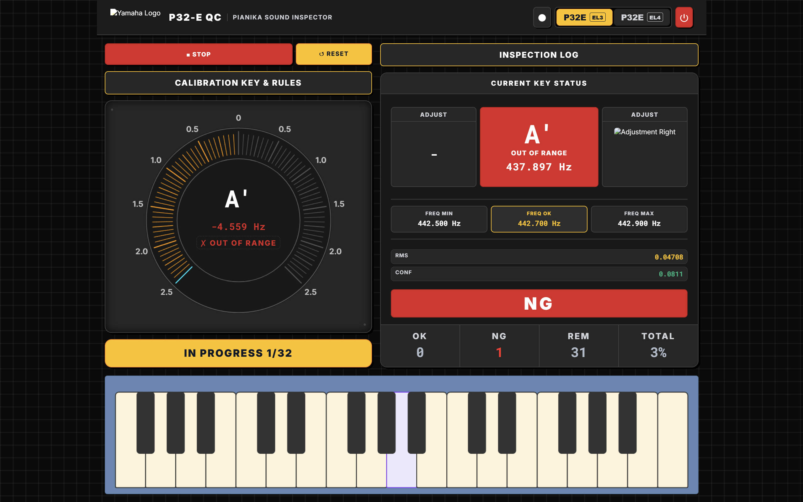
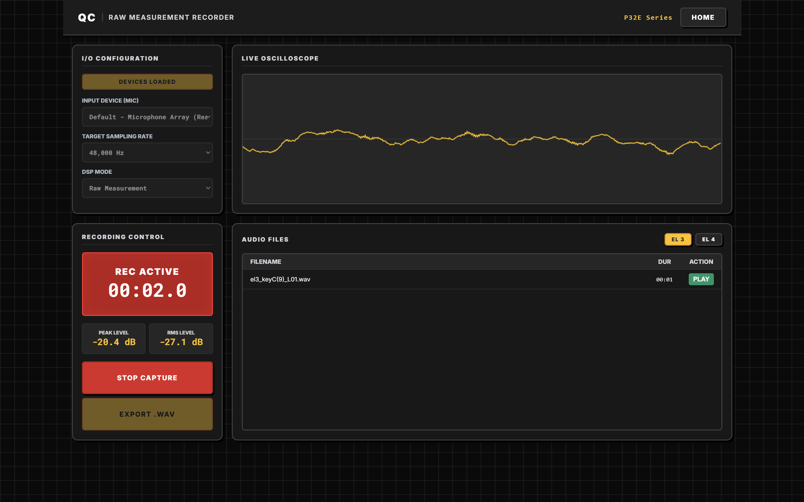

# Inspektur Kualitas Suara P-32E (P-32E QC Sound Inspector)

Sebuah dasbor inspeksi profesional untuk pengendalian kualitas suara secara *real-time* pada instrumen P-32E. Dirancang untuk evaluasi cepat, umpan balik visual, dan alur kerja perekaman audio.

## 🔎 Pratinjau

### Halaman Inspeksi


### Halaman Perekaman Sampel


## ✨ Gambaran Umum

Proyek ini menggabungkan antarmuka web yang responsif dengan analisis audio *real-time*, aturan kalibrasi, dan dukungan perekaman. Dibangun khusus untuk operator QC (Quality Control) yang membutuhkan tampilan nada, frekuensi, dan hasil inspeksi yang jelas serta dapat diandalkan secara langsung.

## 🎯 Fitur Unggulan

- **Deteksi Nada Akurat (Algoritma YIN)**: Menggunakan Algoritma Autokorelasi YIN standar industri untuk mencapai akurasi >96%, dengan tangguh mengatasi masalah gangguan harmonik melengking yang biasa terjadi pada instrumen seperti Pianika.
- Analisis frekuensi dan nada secara *real-time*
- Status inspeksi visual untuk setiap tuts/nada
- Panel aturan kalibrasi dan log inspeksi
- Dukungan perekaman dan penyimpanan otomatis (*auto-save*) untuk sampel WAV/MP3
- Antarmuka bersih yang dioptimalkan untuk alur kerja operator

## 🧩 Struktur Utama

```text
INSPECTION/
├── apps/
│   ├── index_v4.html   # Antarmuka inspeksi utama
│   ├── record.html     # Halaman perekaman dan tinjauan sampel
│   ├── main_v4.js      # Logika inspeksi inti (Algoritma YIN terintegrasi)
│   ├── style_v5.css    # Gaya tampilan UI
│   └── upload.php      # Backend untuk auto-save
├── assets/             # Aset gambar dan pratinjau
└── sample/             # Hasil rekaman sampel yang tersimpan
```

## 🚀 Cara Menjalankan

1. Jalankan XAMPP atau server PHP lokal lainnya.
2. Buka folder proyek di browser Anda.
3. Luncurkan antarmuka utama dari:

```text
http://localhost/INSPECTION/apps/index_v4.html
```

4. Gunakan halaman perekaman untuk menangkap dan memutar sampel:

```text
http://localhost/INSPECTION/apps/record.html
```

## 🔧 Fitur

### Alur Kerja Inspeksi
- Mulai/hentikan pemrosesan sinyal langsung
- Atur ulang (*reset*) dan kalibrasi status inspeksi
- Pantau tingkat desibel (RMS), tingkat keyakinan (*confidence*), dan hasil frekuensi

### Alur Kerja Perekaman
- Tangkap sampel audio langsung dari browser
- Simpan file ke dalam folder sampel di dalam server
- Tinjau dan putar ulang rekaman yang tersimpan langsung dari UI

## 💡 Rekomendasi Penggunaan

Aplikasi ini sangat ideal untuk:
- Stasiun inspeksi QC di jalur produksi
- Validasi suara dan pemeriksaan *tuning*
- Sesi pelatihan operator dan demonstrasi

## 📌 Catatan

- Jalur penyimpanan sampel sengaja ditempatkan di tingkat proyek untuk memudahkan akses dan manajemen file.
- Antarmuka dirancang agar sederhana, mudah dibaca, dan efisien untuk penggunaan produksi sehari-hari.

## 🏁 Ringkasan

Aplikasi Inspektur Kualitas Suara P-32E memberikan pengalaman perkakas yang praktis, rapi, dan profesional untuk inspeksi *real-time* maupun pengumpulan bukti sampel audio.

---

## ⚙️ Detail Teknis: Deteksi Nada Akurat (Algoritma YIN)

Aplikasi ini menggunakan **Algoritma Autokorelasi YIN** alih-alih *Fast Fourier Transform* (FFT) tradisional untuk estimasi frekuensi fundamental. Instrumen seperti Pianika menghasilkan profil harmonik yang sangat kaya, di mana nada harmonik ke-2 atau ke-3 seringkali lebih keras daripada nada fundamentalnya. Deteksi puncak FFT sering kali gagal dalam skenario ini karena mendeteksi harmonik atas yang paling keras. Algoritma YIN mengatasi masalah ini sepenuhnya dengan beroperasi dalam domain waktu untuk mengekstrak siklus gelombang periodik yang tepat.

Baik input dari **Live Mic** maupun rekaman **File WAV**, keduanya diproses menggunakan alur sinyal yang **identik**. Kedua sumber sinyal tersebut akan melewati filter *High-Pass* (150Hz) dan *Low-Pass* (1200Hz) terlebih dahulu untuk membuang noise, kemudian diteruskan ke buffer `AnalyserNode` sebelum dieksekusi secara *real-time* oleh algoritma YIN.

Algoritma YIN memproses buffer audio dalam 5 langkah matematika yang terstruktur:

### 1. Fungsi Selisih (*Difference Function*)
Alih-alih mengandalkan autokorelasi standar, YIN menghitung selisih kuadrat antara sinyal dan versi sinyal yang digeser untuk setiap kemungkinan periode jeda/lag ($\tau$).
$$d_t(\tau) = \sum_{j=1}^{W} (x_j - x_{j+\tau})^2$$
*Di mana $W$ adalah ukuran jendela (window length), dan $x$ adalah sampel audio dalam domain waktu.*

### 2. Fungsi Selisih Normalisasi Rata-rata Kumulatif (*Cumulative Mean Normalized Difference Function / CMNDF*)
Untuk mencegah algoritma memilih jeda $\tau = 0$ (yang selalu menghasilkan selisih 0) dan untuk menormalkan skala, YIN menghitung CMNDF. Langkah ini membagi fungsi selisih dengan rata-rata dari semua nilai selisih sebelumnya.
$$d'_t(\tau) = \begin{cases} 1 & \text{jika } \tau = 0 \\ \frac{d_t(\tau)}{\frac{1}{\tau} \sum_{j=1}^{\tau} d_t(j)} & \text{lainnya} \end{cases}$$

### 3. Ambang Batas Absolut (*Absolute Thresholding*)
Algoritma memindai array CMNDF dan memilih jeda ($\tau$) **pertama** yang nilainya berada di bawah ambang batas yang telah ditentukan (contoh: $0.1$). Ini menjamin bahwa algoritma menemukan periode fundamental yang sebenarnya daripada melompat ke sub-harmonik (kelipatan dari periode sebenarnya). Jika tidak ada jeda yang berada di bawah ambang batas, algoritma akan menggunakan nilai minimum global.

### 4. Interpolasi Parabola (*Parabolic Interpolation*)
Untuk mengatasi keterbatasan dari frekuensi *sampling rate* diskrit ($f_s = 48000 \text{ Hz}$), estimasi puncak presisi desimal (sub-sampel) dilakukan menggunakan interpolasi parabola di sekitar nilai minimum lokal ($\tau$).
$$\tau_{\text{interp}} = \tau + \frac{\alpha - \gamma}{2(\alpha - 2\beta + \gamma)}$$
*Di mana $\alpha, \beta, \gamma$ masing-masing adalah nilai CMNDF pada posisi $\tau-1, \tau, \text{dan } \tau+1$.*

### 5. Konversi Frekuensi (*Frequency Conversion*)
Terakhir, periode gelombang yang telah diinterpolasi ($\tau_{\text{interp}}$) dikonversi menjadi frekuensi fundamental riil ($f$).
$$f = \frac{f_s}{\tau_{\text{interp}}}$$

---

## 👶 Penjelasan Sederhana (Bahasa Bayi): Kenapa YIN Sangat Cerdas?

Bayangkan kamu punya sebuah gambar garis coret-coretan yang sangat berantakan dan rumit (ini adalah suara dari Pianika). Di dalam coret-coretan itu, ada gunung yang sangat tinggi dan bukit-bukit kecil.

**Bagaimana cara lama (FFT) bekerja?**
Cara lama hanya melihat: *"Mana gunung yang paling tinggi?"* 
Masalahnya, pada alat musik seperti Pianika, nada asli yang kita pencet (misalnya nada **F**) seringkali wujudnya berupa bukit kecil, sedangkan suara melengking lain yang ikut berbunyi (harmonik/suara sisa) malah membentuk gunung yang sangat tinggi. Cara lama akan menunjuk gunung tinggi itu dan salah menebak nadanya.

**Bagaimana YIN bekerja?**
YIN tidak peduli seberapa tinggi gunung atau bukitnya. Cara kerja YIN seperti ini:
1. YIN memfotokopi gambar coret-coretan berantakan tadi di atas kertas plastik transparan.
2. Kemudian, YIN menggeser kertas plastik itu pelan-pelan ke sebelah kanan di atas gambar aslinya.
3. YIN terus menggeser sampai *semua* coret-coretan berantakan di plastik itu **menumpuk pas dan persis (cocok 100%)** dengan gambar aslinya.
4. Jarak seberapa jauh YIN harus menggeser plastik itu disebut sebagai "Siklus" (Periode).

**Contoh Kasus: Frekuensi "Amburadul" menghasilkan nada F**
Katakanlah kamu meniup nada **F (176 Hz)**. Suara yang keluar sangat amburadul: ada campuran suara desis angin, suara melengking tinggi, dan lain-lain. 

Jika pakai cara lama, komputer akan melihat suara melengking (yang kebetulan paling keras) dan bilang: *"Wah, ini nada C tinggi!"*

Tapi YIN mengambil *seluruh* pola suara amburadul itu, memfotokopinya, dan menggesernya. YIN lalu menyadari: *"Tunggu dulu, walaupun polanya sangat berantakan, tapi seluruh gambar berantakan ini SELALU berulang atau menumpuk pas setiap digeser sejauh jarak tertentu!"* 

Setelah dihitung, ternyata pola amburadul itu mengulang dirinya sendiri sebanyak persis **176 kali dalam satu detik**. Dari situlah YIN dengan sangat yakin dan cerdas berkata: *"Ah! Pola berantakan ini berulangnya 176 kali sedetik. Apapun suara bising di dalamnya, ini pasti nada F!"*

---

## 🤖 Integrasi Robot / Perangkat Luar (Contoh: FANUC CRX-10)

Aplikasi web ini dilengkapi dengan variabel status I/O (Input/Output) global yang dirancang khusus untuk dibaca oleh perangkat eksternal atau robot *tuning*. Variabel ini hidup di atas *context window* pada JavaScript browser.

**Nama Variabel:** `window.ROBOT_TUNING_IO`

### Cara Kerja:
- **Nilai `1` (High / OK):** Ini adalah nilai bawaan. Menandakan bahwa frekuensi nada yang diinspeksi masuk dalam toleransi (*pass*). Robot tidak perlu melakukan tindakan apa pun.
- **Nilai `0` (Low / NG):** Jika hasil evaluasi nada dari aplikasi dinyatakan **NG (Not Good)**, variabel ini seketika berubah menjadi `0`. Ini bertindak sebagai sinyal *trigger* yang menginstruksikan robot untuk segera memulai pergerakan *tuning reed*.

### Cara Pemakaian:
Untuk menyambungkan variabel browser ini ke I/O register fisik pada robot (seperti FANUC), Anda dapat menggunakan skrip perantara (*bridge script*), misalnya dengan **Node.js (Puppeteer/Selenium)** atau aplikasi WebSocket lokal yang memantau nilai variabel ini secara berkala (*polling*).

**Contoh ilustrasi *bridge script* (menggunakan Puppeteer):**
```javascript
// Script ini berjalan di PC yang sama dengan browser inspeksi
setInterval(async () => {
    // Membaca nilai dari layar inspeksi (Browser Context)
    let isNeedTuning = await page.evaluate(() => window.ROBOT_TUNING_IO === 0);

    if (isNeedTuning) {
        // Kirim sinyal Modbus / TCP ke FANUC I/O Register untuk Set Low (0)
        sendModbusTriggerToFanuc();
    }
}, 100); // Cek setiap 100 ms
```