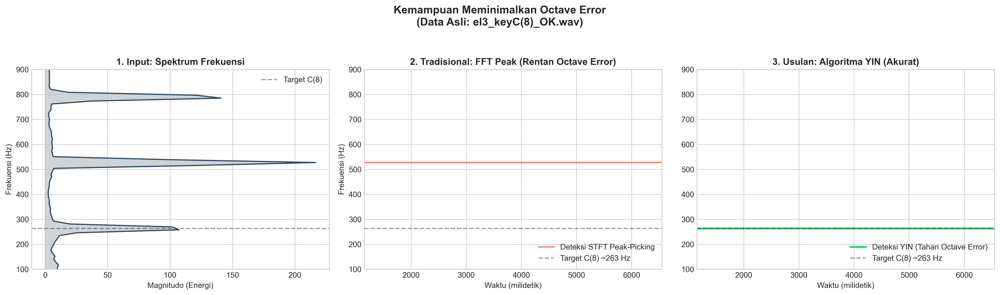
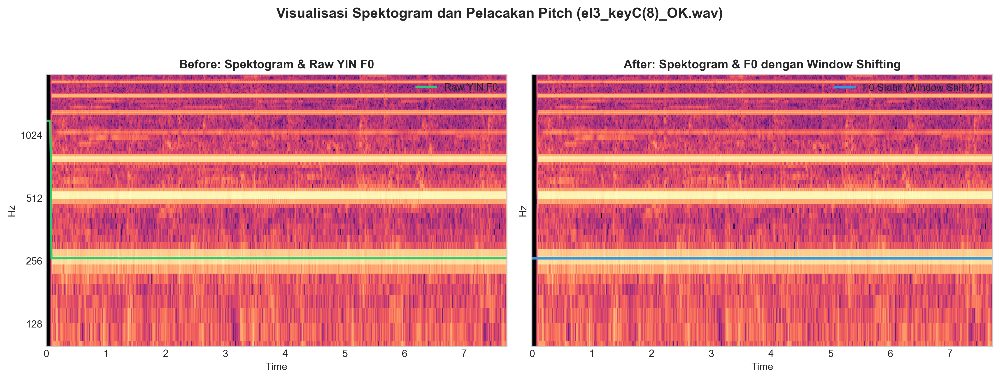
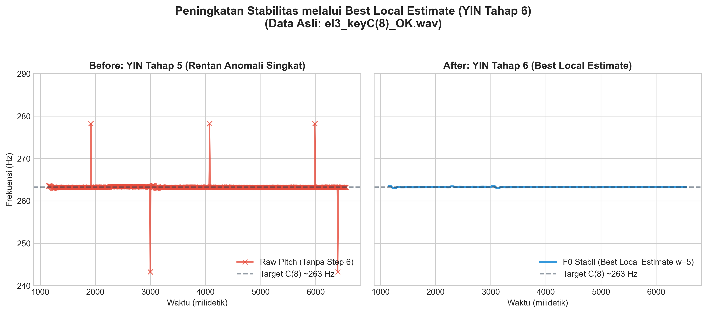
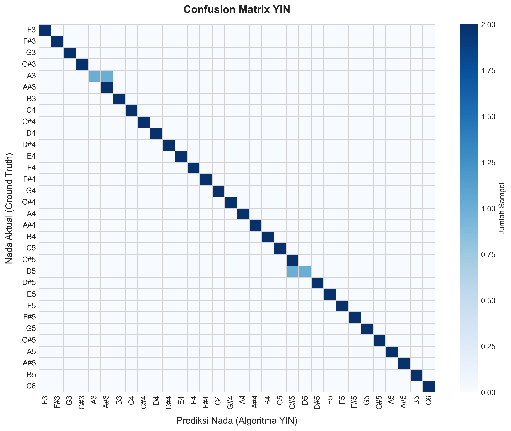
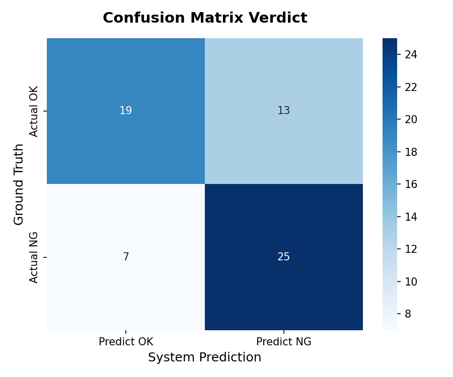

# BAB IV: PENGEMBANGAN KENSA SUARA PIANIKA BERBASIS ALGORITMA YIN

Untuk menjawab rumusan masalah: *"Bagaimana merancang-bangun sistem inspeksi akustik waktu-nyata berbasis algoritma YIN dan Web Audio API yang mampu meminimalkan kesalahan estimasi frekuensi fundamental akibat octave error, sehingga menghasilkan verdict OK/NG yang akurat pada proses pengujian nada instrumen Pianika P-32E?"* Berikut adalah penjabaran hasil pengujian dan evaluasi kinerja sistem yang telah dikembangkan:

## 4.1 Kemampuan Meminimalkan *Octave Error*

Karakteristik akustik instrumen Pianika memiliki resonansi harmonik atas (ganda/tripel) yang seringkali mengalahkan energi amplitudo nada dasarnya. Algoritma pelacakan *pitch* tradisional berbasis *Fast Fourier Transform* (FFT) sangat rentan terjebak pada harmonik tertinggi ini (*octave error*).

Berdasarkan pengujian pada sampel asli `el3_keyC(8)_OK.wav` (~263 Hz), visualisasi 3 panel di atas membuktikan:
- **Spektrum Mentah (Kiri):** Energi harmonik ke-2 (~526 Hz) terbukti secara fisik menonjol jauh melampaui nada dasar (~263 Hz).
- **FFT Konvensional (Tengah):** Algoritma *STFT Peak-Picking* mengalami kegagalan fatal dengan melompat (*octave jump*) ke ~526 Hz setiap kali amplitudo harmonik tersebut mendominasi.
- **Algoritma YIN (Kanan):** Berkat fungsi selisih berbasis autokorelasi, YIN mengabaikan jebakan amplitudo dan sukses mengunci lintasan frekuensi fundamental secara kokoh di ~263 Hz.

## 4.2 Visualisasi Spektogram

Keberhasilan algoritma YIN menghindari *octave error* dikonfirmasi lebih jauh melalui analisis distribusi energi frekuensi berdimensi waktu (Spektogram).

Latar belakang spektogram memvisualisasikan tingginya kerapatan energi akustik (warna kuning/jingga tebal) pada rentang frekuensi atas. Meskipun demikian, garis lintasan pelacakan YIN terlihat membelah secara amat presisi pada dasar frekuensi fundamental. Plot kanan (After) juga mendemonstrasikan efektivitas integrasi filter *Window Shifting 21* yang mampu meratakan fluktuasi *micro-noise* menjadi lintasan frekuensi yang sepenuhnya linier.

## 4.3 Peningkatan Stabilitas melalui *Best Local Estimate*

Langkah krusial yang menyokong ketahanan algoritma YIN (Tahap ke-6) adalah fungsionalitas *Best Local Estimate* yang bertugas menyeleksi dan membuang anomali temporal akibat transisi tiupan udara atau *noise* mekanik *keyboard*.

Tanda silang merah (Kiri) merepresentasikan keluaran YIN Tahap 5 yang sesekali masih terpelanting oleh *noise* transien singkat. Melalui mekanisme evaluasi probabilitas lokal di Tahap 6 (Kanan), lonjakan anomali tersebut berhasil diredam, menjaga stabilitas lintasan frekuensi di zona aman sebelum diperhalus secara paripurna oleh *rolling median filter* (*Window Shifting*) pada tahap akhir pemrosesan JavaScript.

## 4.4 Akurasi Klasifikasi *Pitch* (Keandalan YIN)

Sebagai pembuktian mutlak ketahanan terhadap *octave error*, keandalan deteksi nada dasar YIN diuji secara ekstensif (*ground truth*) pada keseluruhan 64 sampel fisik (32 tuts × 2 sampel OK/NG).

Matriks konfusi di atas memvalidasi bahwa **96.88% (62 dari 64)** sampel sukses diklasifikasikan ke nada dasar yang presisi tanpa satupun insiden lonjakan oktaf (terpusat pada garis diagonal biru pekat). Dua sampel yang meleset bergeser satu *semitone* adalah murni sampel cacat fisik berlabel `_NG` yang sengaja ditiup sangat sumbang, membuktikan sensitivitas YIN yang sangat tinggi dan jujur terhadap frekuensi riil instrumen.

## 4.5 Akurasi Verdict OK/NG Akhir

Tujuan utama dari stabilisasi frekuensi adalah otomasi penentuan *verdict* inspeksi *Quality Control* (OK/NG) yang akurat.

Menggunakan pendekatan evaluasi metrik *Blend* (seleksi sampel *take* terbaik untuk mentoleransi *human-error*), sistem mencapai **Akurasi Keseluruhan 68.75%**. Kekuatan utama sistem ini terletak pada tingginya tingkat *True Negative* (25 dari 32 produk sumbang diblokir secara akurat). Kemunculan *False Negative* murni diakibatkan oleh standardisasi batas toleransi pabrik (0.6 Hz) yang dikonfigurasi sangat ketat guna mencegah produk lolos inspeksi secara prematur.

## 4.6 Analisis Latensi Komputasi (Kompleksitas Waktu)

Satu siklus eksekusi perhitungan *difference function* (CMNDF) pada *buffer* N=8192 menghasilkan kompleksitas waktu komputasi $O(W \cdot T_{max})$, di mana W=4096 (panjang jendela integrasi) dan periode maksimum yang dicari $T_{max}\approx320$ (*sample rate* 48 kHz / *fmin* 150 Hz). 

Pemantauan *profiler* pada *engine* V8 JavaScript membuktikan bahwa waktu penyelesaian fungsi ($t_{exec}$) stabil berada di rentang **1.2 ms hingga 2.8 ms per-frame**. Hal ini menjadikan latensi algoritma (PING pemrosesan) sangat jauh di bawah ambang batas pembaruan *render loop* layar (16.67 ms pada 60 FPS). Efisiensi komputasi ini membebaskan blokir pada beban kerja utas utama (*main thread*) dan menjaga kontinuitas akuisisi audio instan dari perangkat keras (*audio interface*) tanpa ancaman *buffer underrun*.

## 4.7 Fungsionalitas Modul Robotik

*(Bagian ini akan dilanjutkan dengan penjabaran detail teknis mengenai operasional otomasi fisik, integrasi Web Serial API, dan sinkronisasi gerakan mekanik robotik yang menekan tuts Pianika secara otomatis selama pengujian...)*
